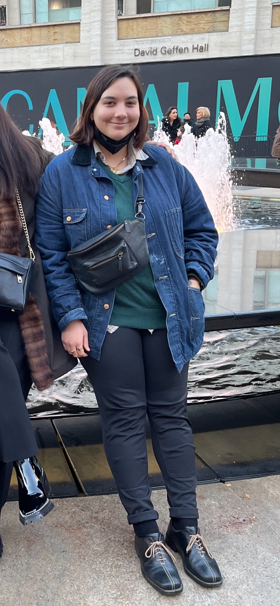

<head>

    <meta charset="utf-8">
    <meta name="viewport" content="width=device-width, initial-scale=1, shrink-to-fit=no">

    <link rel="stylesheet" href="https://stackpath.bootstrapcdn.com/bootstrap/4.3.1/css/bootstrap.min.css" integrity="sha384-ggOyR0iXCbMQv3Xipma34MD+dH/1fQ784/j6cY/iJTQUOhcWr7x9JvoRxT2MZw1T" crossorigin="anonymous">
    <link href="./webpage.css" rel="stylesheet" />
</head>

<nav class="navbar navbar-expand-lg navbar-dark bg-dark">
    

      <a class="navbar-brand" href="#">Portfolio Project</a>
      <button class="navbar-toggler" type="button" data-bs-toggle="collapse" data-bs-target="#navbarNavAltMarkup" aria-controls="navbarNavAltMarkup" aria-expanded="false" aria-label="Toggle navigation">
        
      </button>
      

        

            <li class="nav-item">
                <a class="nav-link active" aria-current="page" href="file:///Users/janec/vscode/Portoflio%20webpage/webpage.html">Home</a>
              </li>
              <li class="nav-item">
                <a class="nav-link" href="file:///Users/janec/vscode/Portoflio%20webpage/repositories.html">Repositories</a>
              </li>
        

      

    

  </nav>

  

        

    

